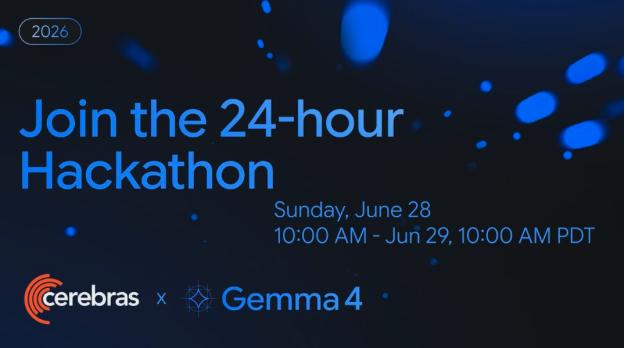
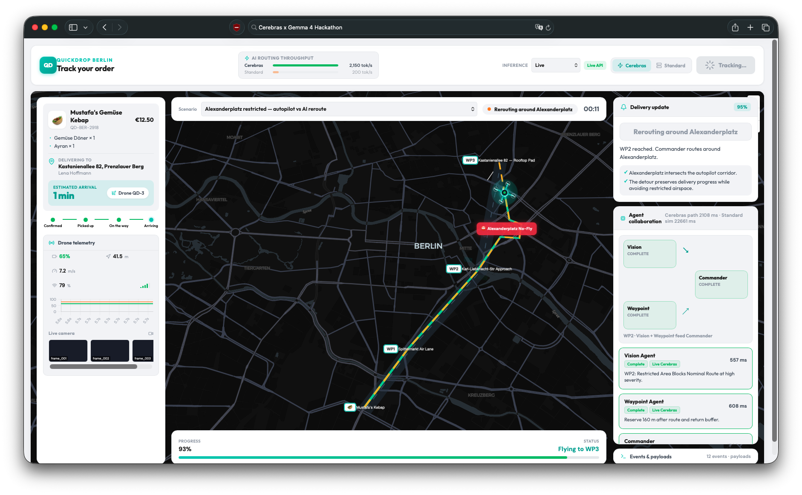

# DroneGuard Multiverse



DroneGuard Multiverse is a multi-agent drone safety simulator built for the
[Cerebras x Google Gemma 4 hackathon](https://luma.com/cerebras-piwl). It uses
Gemma 4 31B on Cerebras to reason over drone camera frames, telemetry, waypoint
risk, and safety actions in a simulated delivery mission.

The project is scoped as an operator-assistance simulator. It does not control a
real drone.

[Demo video](https://youtu.be/QicMN4NEkBo) ·
[Hackathon event](https://luma.com/cerebras-piwl) ·
[Cerebras Gemma 4 31B docs](https://inference-docs.cerebras.ai/models/gemma-4-31b)



## Why This Project

Physical-world AI systems are sensitive to latency. In DroneGuard Multiverse,
the same safety decision has different outcomes depending on inference speed:

- With fast Cerebras inference, agents respond early enough for the drone to
  smoothly detour around a no-fly zone.
- With a slower standard GPU simulation, the Commander instruction can arrive
  after the drone has already entered restricted airspace.

This makes the demo more than a chatbot-style agent workflow: model latency
changes the simulated physical outcome.

## Agent System

The backend coordinates three specialized agents:

| Agent | Inputs | Responsibility |
| --- | --- | --- |
| Vision Agent | Drone camera keyframes and scenario context | Detect visual hazards, restricted corridors, and route evidence. |
| Waypoint Agent | Telemetry CSVs, route metrics, battery reserve, speed, waypoint state | Evaluate reachability, mission reserve, and route risk. |
| Commander Agent | Normalized Vision and Waypoint outputs plus allowed actions | Choose `continue_mission`, `detour_obstacle`, `return_to_start`, or `hold_position`. |

Vision and Waypoint agents run in parallel. The Commander waits for both
outputs before making the safety decision.

## Engineering Highlights

- Multi-agent orchestration with parallel Vision and Waypoint execution.
- Structured JSON outputs validated locally with Pydantic models.
- Live, refresh, and replay modes for reliable demos without hiding cache usage.
- Raw request/response payloads, cache hits, latency, and decision events exposed
  in the UI observability panel.
- Optional Arize Phoenix tracing through OpenTelemetry/OpenInference for
  Pydantic AI runs.
- Scenario simulation for detours, return-to-start, waypoint holds, and late
  Standard GPU responses.
- Lightweight Python backend with a static browser UI, avoiding unnecessary
  infrastructure for a hackathon prototype.

## Hackathon Context

The project was built during the Cerebras x Gemma 4 hackathon. We had early
access to Gemma 4 31B on Cerebras and used the project to explore how fast
inference affects safety-critical multi-agent workflows.

The repo includes cached response seeds so the demo can be replayed reliably.
Live and refresh modes require a Cerebras API key.

## Tech Stack

Model and inference:

- Cerebras Inference API
- `gemma-4-31b`
- OpenAI Python SDK
- OpenAI-compatible SDK transport for raw Cerebras Chat Completions
- Pydantic AI Cerebras provider for structured text agents

Agents and validation:

- Python backend
- Pydantic models and schema validation
- Deterministic reachability and route-risk helpers
- Cached replay layer for recorded model calls

Observability:

- Arize Phoenix
- OpenTelemetry
- OpenInference Pydantic AI instrumentation
- Local JSONL trace events
- LangSmith was evaluated in earlier project notes; the current implementation uses
  Phoenix for tracing and the in-app event log for demo inspection.

Frontend and simulation UI:

- Static HTML, CSS, and JavaScript
- MapLibre GL for map rendering
- Chart.js for telemetry charts
- Lucide icons

Development and testing:

- `uv`
- `pytest`
- stdlib `ThreadingHTTPServer` API

## Repository Layout

```text
.
|-- data/samples/                    # scenarios, telemetry, keyframes, replay cache seeds
|-- docs/                            # architecture notes, runbook, screenshots, integration docs
|-- scripts/                         # sample asset generation
|-- src/droneguard_multiverse/
|   |-- agents/                      # Vision, Waypoint/Telemetry, and Commander agents
|   |-- api/                         # lightweight backend routes
|   |-- cache/                       # Cerebras response cache and replay helpers
|   |-- integrations/cerebras/       # Cerebras client, prompts, image input helpers
|   |-- integrations/pydantic_ai/    # Pydantic AI Cerebras runtime bridge
|   |-- observability/               # Phoenix config, trace events, JSONL trace store
|   |-- orchestration/               # scenario execution and agent coordination
|   |-- schemas/                     # scenario, telemetry, and agent output models
|   `-- simulation/                  # reachability and route-risk logic
|-- tests/                           # loaders, validation, cache, orchestration, integration tests
`-- web/                             # browser demo UI
```

## Run Locally

Replay mode works without credentials:

```bash
PYTHONPATH=src uv run python -m droneguard_multiverse.api.routes --host 127.0.0.1 --port 8000
```

Open:

- Main UI: <http://127.0.0.1:8000>
- Modern delivery simulation UI: <http://127.0.0.1:8000/demo>

For live Cerebras calls:

```bash
cp .env.example .env
# set CEREBRAS_API_KEY in .env
```

Recommended runtime:

```bash
DRONEGUARD_MODEL=gemma-4-31b
DRONEGUARD_AGENT_RUNTIME=pydantic_ai
```

Vision uses the raw Cerebras client for multimodal image messages. Structured
text agents use Pydantic AI when an output model is supplied.

## Arize Phoenix Tracing

Phoenix is optional. The UI still shows local trace events, payloads, cache
status, and latencies when Phoenix is disabled.

To enable Phoenix:

```bash
uv run phoenix serve
```

Then set:

```bash
PHOENIX_TRACING=true
PHOENIX_COLLECTOR_ENDPOINT=http://127.0.0.1:6006
PHOENIX_PROJECT_NAME=droneguard-multiverse
```

Open <http://127.0.0.1:6006> to inspect traces.

## Tests

```bash
uv run --with pytest pytest
```

The test suite covers scenario loading, telemetry validation, image encoding,
Pydantic AI integration behavior, cache replay, Phoenix configuration, and full
orchestration replay paths.

## Key Documentation

- [Architecture](docs/ARCHITECTURE.md)
- [Cerebras integration notes](docs/CEREBRAS_INTEGRATION.md)
- [Data contracts](docs/DATA_CONTRACTS.md)
- [Web app and observability](docs/WEB_APP_AND_OBSERVABILITY.md)
- [Demo runbook](docs/DEMO_RUNBOOK.md)
